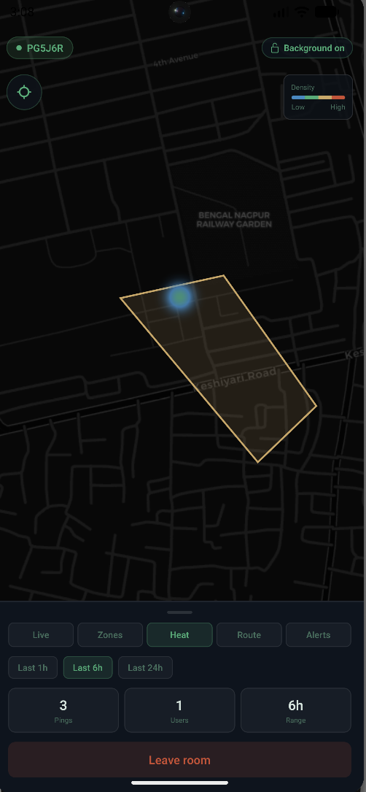

# GeoSync

Real-time multi-user location tracking for Android. Share your live position with a private room, keep tracking **with the screen locked**, get geofence enter/exit alerts, replay routes, and see a visit-density heatmap.

<p align="center">
  
</p>

<p align="center">
  <em>A geofence zone, the visit-density heatmap, and live stats — with background tracking on.</em>
</p>

## Try it

| | |
|---|---|
| **Download the APK** | **[GeoSync.apk](https://expo.dev/artifacts/eas/yy7f2UzB2SyjCF16Uj6y7OcEdzcCauekMowuXQ6I49M.apk)** (Android) |
| **Live API** | https://geosync-api-vh6b.onrender.com/health |

**Installing:** allow *"install from unknown sources"*, then grant location **"Allow all the time"** — background tracking needs it. Register, create a room, and share the 6-character code.

> The API is on a free tier that sleeps when idle, so the **first request can take ~50 s** to wake. After that it's fast.

## Features

- **Live location sharing** — private rooms, join by 6-char code
- **Background tracking** — keeps reporting when the app is closed and the phone is locked
- **Geofencing** — draw a zone on the map *or* trace it by physically walking the boundary; everyone in the room gets **enter/exit alerts**
- **Route history** — replay anyone's path over the last 1h/6h/24h
- **Heatmap** — visit-density over time

## Tech

**Mobile** — React Native (Expo SDK 54), MapLibre (free OSM/CARTO tiles, no API key), Socket.IO client
**Backend** — Node.js, Express, Socket.IO, PostgreSQL + **PostGIS**, Redis (optional)
**Infra** — Render (API) · Neon (Postgres + PostGIS)

## How it works

**Sending vs receiving are split by transport, on purpose:**

```
send    →  HTTP POST /api/location   (a WebSocket dies when the phone locks; an HTTP request doesn't)
receive →  Socket.IO                 (real-time push while the app is open)
```

Both paths funnel into one service that persists the ping, runs the geofence check, and broadcasts to the room.

**PostGIS does the spatial work:**
- `ST_Within` — geofence containment, GIST-indexed (O(log n), not a per-client point-in-polygon loop)
- `ST_MakeLine` — route history as a GeoJSON LineString
- Grid aggregation (`ROUND` + `GROUP BY` + `COUNT`) — heatmap density cells

**Location sampling is distance-based** (~30 m of movement), not a fixed interval, plus a 2-minute heartbeat so a stationary user doesn't go silent. That cut ping volume ~35× versus polling — the difference between draining a phone battery / blowing a free-tier quota and not.

**Redis** holds geofence enter/exit state and can back the Socket.IO Pub/Sub adapter for horizontal scaling. It's config-gated (`USE_REDIS_ADAPTER`): production runs a single instance, so the adapter is off — with no peers to fan out to it would cost a `PUBLISH` per broadcast for nothing. Falls back to in-memory state when Redis is absent.

## Run locally

**Backend** — needs PostgreSQL with PostGIS:
```bash
cp .env.example .env        # fill in DB creds + JWT_SECRET
psql -U <user> -d geosync -f init.sql
npm install
node server.js              # http://localhost:3000
```

**Mobile** — point `mobile/src/lib/config.js` at your backend
(`http://10.0.2.2:3000` for the Android emulator), then:
```bash
cd mobile
npm install
npx expo start
```
MapLibre and background location are native modules, so a [dev build](https://docs.expo.dev/develop/development-builds/introduction/) is required — Expo Go won't work.

## Deployment

See **[DEPLOY.md](DEPLOY.md)** — Neon + Render, both free tiers.
